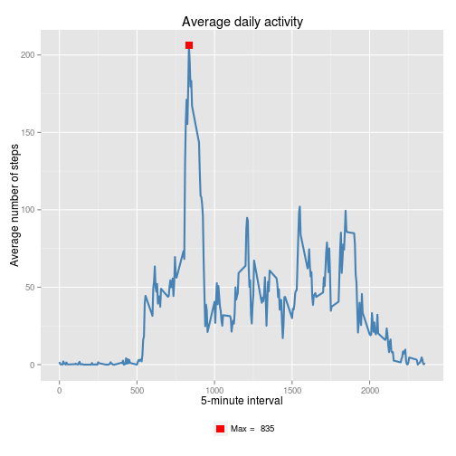
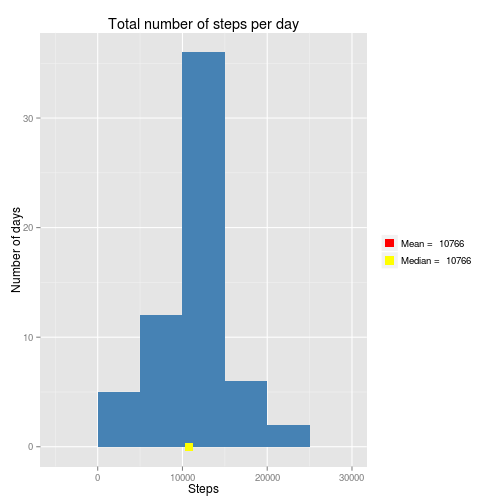

# Reproducible Research: Peer Assessment 1

## Loading and preprocessing the data
Load, clean, and view summary of the data.


```r
set.seed(0)
library(lattice)
library(ggplot2)
activity <- read.csv("activity.csv")
activity$datetime <- strptime(activity$date, format = "%Y-%m-%d")
activity$date <- as.Date(activity$date)
summary(activity)
```

```
##      steps            date               interval       datetime         
##  Min.   :  0.0   Min.   :2012-10-01   Min.   :   0   Min.   :2012-10-01  
##  1st Qu.:  0.0   1st Qu.:2012-10-16   1st Qu.: 589   1st Qu.:2012-10-16  
##  Median :  0.0   Median :2012-10-31   Median :1178   Median :2012-10-31  
##  Mean   : 37.4   Mean   :2012-10-31   Mean   :1178   Mean   :2012-10-31  
##  3rd Qu.: 12.0   3rd Qu.:2012-11-15   3rd Qu.:1766   3rd Qu.:2012-11-15  
##  Max.   :806.0   Max.   :2012-11-30   Max.   :2355   Max.   :2012-11-30  
##  NA's   :2304
```

## What is mean total number of steps taken per day?
Make a histogram of the total number of steps taken each day


```r
total_steps <- aggregate(activity$steps, by=list(activity$date), sum, na.rm=T)
colnames(total_steps) <- c("date", "steps")
ggplot(total_steps, aes(x=steps)) +
  geom_histogram(fill="steelblue", binwidth=5000) +
  labs(title="Total number of steps per day",
       x="Steps",
       y="Number of days") +
  geom_point(aes(x=mean(total_steps$steps),
                 y=0, color="red"), 
             size=4, shape=15) +
  geom_point(aes(x=median(total_steps$steps),
                 y=0, color="yellow"), 
             size=4, shape=15) +
  scale_color_manual(name = element_blank(),
                     labels = c(paste("Mean = ", 
                                      round(mean(total_steps$steps))),
                                paste("Median = ",
                                      round(median(total_steps$steps)))),
                     values = c("red", "yellow"))
```

 

Calculate and report the **mean** and **median** total number of steps taken per day


```r
mean(total_steps$steps)
```

```
## [1] 9354
```

```r
median(total_steps$steps)
```

```
## [1] 10395
```


## What is the average daily activity pattern?
Make a time series plot of the 5-minute interval and the average number of steps taken, averaged across all days


```r
interval_avg <- aggregate(activity$steps,
                          by=list(activity$interval), mean, na.rm = T)
colnames(interval_avg) <- c("interval", "avg")

max_interval <- interval_avg[interval_avg$avg == max(interval_avg$avg),]

ggplot(interval_avg, aes(x=interval, y=avg)) + 
  geom_line(color="steelblue", size=1) +
  labs(title="Average daily activity",
       x="5-minute interval",
       y="Average number of steps") +
  geom_point(aes(x=max_interval$interval,
                 y=max_interval$avg, color="red"), size=4, shape=15) +
  theme(legend.position="bottom") +
  scale_color_manual("", values=c("red"), 
                     labels=c(paste("Max = ", max_interval$interval)))
```

 

Find which 5-minute interval, contains the maximum number of steps


```r
interval_avg[interval_avg$avg == max(interval_avg$avg),]
```

```
##     interval   avg
## 104      835 206.2
```

## Imputing missing values
Calculate and report the total number of missing values in the dataset


```r
sum(is.na(activity$steps))
```

```
## [1] 2304
```

**Strategy for filling in NA**

Fill NA with average of interval (which is calculated in previous part)

Create a new dataset that is equal to the original dataset but with the missing data filled in.


```r
activity_imputed <- activity
missing <- is.na(activity$steps)

interval_avg <- tapply(activity$steps, activity$interval, mean, na.rm = T)
activity_imputed$steps[missing] <- 
  interval_avg[as.character(activity$interval[missing])]
```

Make a histogram of the total number of steps taken each day and Calculate and report the mean and median total number of steps taken per day


```r
total_steps <- aggregate(activity_imputed$steps,
                         by=list(activity_imputed$date), sum, na.rm=T)
colnames(total_steps) <- c("date", "steps")
ggplot(total_steps, aes(x=steps)) +
  geom_histogram(fill="steelblue", binwidth=5000) +
  labs(title="Total number of steps per day",
       x="Steps",
       y="Number of days") +
  geom_point(aes(x=mean(total_steps$steps),
                 y=0, color="red"), 
             size=4, shape=15) +
  geom_point(aes(x=median(total_steps$steps),
                 y=0, color="yellow"), 
             size=4, shape=15) +
  scale_color_manual(name = element_blank(),
                     labels = c(paste("Mean = ", 
                                      round(mean(total_steps$steps))),
                                paste("Median = ",
                                      round(median(total_steps$steps)))),
                     values = c("red", "yellow"))
```

 

```r
mean(total_steps$steps)
```

```
## [1] 10766
```

```r
median(total_steps$steps)
```

```
## [1] 10766
```

**Conclusion**: Filling NA values changed both mean and median.

## Are there differences in activity patterns between weekdays and weekends?
Create a new factor variable in the dataset with two levels – “weekday” and “weekend”


```r
activity_imputed$weekday <- weekdays(activity_imputed$datetime)
activity_imputed$weekday <- ifelse(
  (activity_imputed$weekday == "Saturday") 
  | (activity_imputed$weekday == "Sunday"),
  "weekend",
  "weekday")
activity_imputed$weekday <- factor(activity_imputed$weekday)
```

Make a panel plot containing a time series plot of the 5-minute interval and the average number of steps taken, averaged across all weekday days or weekend days.


```r
activity_weekday = activity_imputed[activity_imputed$weekday == "weekday",]
activity_weekend = activity_imputed[activity_imputed$weekday == "weekend",]
interval_avg_weekday <- tapply(activity_weekday$steps,
       activity_weekday$interval,
       mean)
interval_avg_weekend <- tapply(activity_weekend$steps,
       activity_weekend$interval,
       mean)

avg <- data.frame(
  c(interval_avg_weekday, interval_avg_weekend),
  c(unique(activity_weekday$interval),
        unique(activity_weekend$interval)),
  c(rep("weekday", length(interval_avg_weekday)),
        rep("weekend", length(interval_avg_weekend)))
  )
colnames(avg) <- c("steps", "interval", "weekday")

xyplot(steps ~ interval | weekday,
       data = avg,
       layout=c(1,2),
       xlab="Interval",
       ylab="Number of steps",
       type="l")
```

 

**Conclusion**: On the weekday, the number of steps have a clear peek, while on the weekend, the steps are spread throughout the day.
